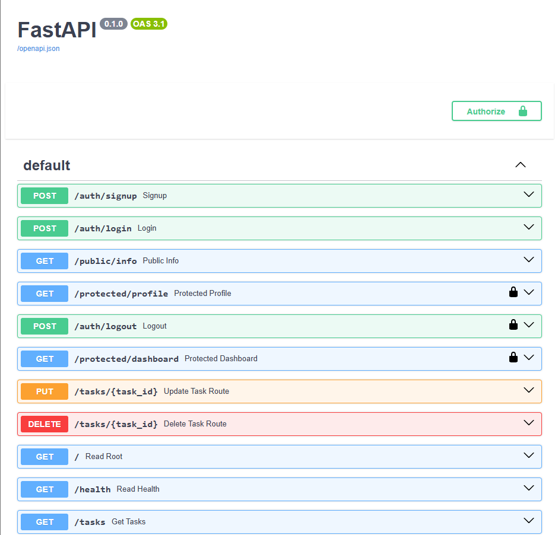

# FlyRank Backend Task API

A FastAPI backend implementing authentication, JWT verification, protected routes, logout, and Swagger API documentation using Supabase Auth.

The project was built as part of the FlyRank AI Backend Track and extends a task CRUD API with Supabase-based authentication.

## Tech Stack

* Python
* FastAPI
* Supabase Auth
* PostgreSQL
* Docker
* Docker Compose
* Swagger UI / OpenAPI

## Features

* User signup
* User login
* Supabase JWT verification
* Reusable authentication dependency
* Protected API routes
* Logout
* Public API route
* PostgreSQL-backed task API
* Interactive Swagger documentation
* Environment-based configuration
* Docker Compose setup

## Project Structure

```text
.
├── main.py
├── database.py
├── repository.py
├── supabase_client.py
├── Dockerfile
├── compose.yaml
├── requirements.txt
├── .env.example
├── .gitignore
└── docs/
    └── swagger-auth.png
```

## Environment Setup

Create a local `.env` file from the example:

```powershell
Copy-Item .env.example .env
```

Then replace the placeholder values with your own configuration.

Required variables:

```env
DATABASE_URL=postgres://postgres:your_password@db:5432/tasks
POSTGRES_PASSWORD=your_password
POSTGRES_DB=tasks

SUPABASE_URL=https://your-project-ref.supabase.co
SUPABASE_PUBLISHABLE_KEY=your_supabase_publishable_key
SUPABASE_JWKS_URL=https://your-project-ref.supabase.co/auth/v1/.well-known/jwks.json

PORT=3000
```

Never commit `.env` or any Supabase secret/service-role key.

## Run the API

Start the complete application with one command:

```powershell
docker compose up --build
```

The API will be available at:

```text
http://localhost:3000
```

Swagger UI:

```text
http://localhost:3000/docs
```

## API Reference

| Method | Endpoint               | Authentication | Description                                           |
| ------ | ---------------------- | -------------- | ----------------------------------------------------- |
| POST   | `/auth/signup`         | No             | Create a new user                                     |
| POST   | `/auth/login`          | No             | Authenticate a user and return JWT tokens             |
| POST   | `/auth/logout`         | Yes            | Sign out the authenticated user                       |
| GET    | `/public/info`         | No             | Public API information                                |
| GET    | `/protected/profile`   | Yes            | Return authenticated user metadata                    |
| GET    | `/protected/dashboard` | Yes            | Example protected route using the reusable auth guard |

Protected endpoints require:

```text
Authorization: Bearer <access_token>
```

## Authentication Flow

```text
Signup
  ↓
Login
  ↓
Supabase returns access token
  ↓
Authorization: Bearer <access_token>
  ↓
FastAPI authentication dependency
  ↓
Supabase verifies token
  ↓
Protected route
```

The authentication logic is centralized in a reusable FastAPI dependency, so protected routes do not duplicate JWT verification code.

## Swagger UI

FastAPI exposes interactive OpenAPI documentation at `/docs`.

The protected routes use HTTP Bearer authentication, allowing a JWT to be entered once through Swagger's **Authorize** button and reused when testing protected endpoints.



## Security

* `.env` is excluded through `.gitignore`
* Supabase publishable credentials are loaded from environment variables
* Supabase secret/service-role credentials are not required by the application
* JWTs are verified through Supabase Auth
* Protected routes use a shared authentication dependency
* Real credentials should never be committed to Git

## GitHub

The project is published as a public repository for review and reproducibility.

A fresh clone can provide its own environment variables and run the API using Docker Compose.
